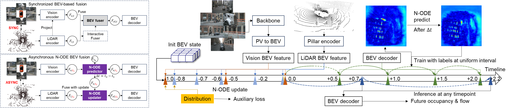

<div align="center">   
  
# StreamingFlow: Streaming Occupancy Forecasting with Asynchronous Multi-modal Data Streams via Neural Ordinary Differential Equation
</div>

This repo introduces StreamingFlow.

## Demo video


## Framework



## Abstract

Predicting the future occupancy states of the surrounding environment is a vital task for autonomous driving. However, current best-performing single-modality methods or multi-modality fusion perception methods are only able to predict uniform snapshots of future occupancy states and require strictly synchronized sensory data for sensor fusion. We propose a novel framework, StreamingFlow, to lift these strong limitations. StreamingFlow is a novel BEV occupancy predictor that ingests asynchronous multi-sensor data streams for fusion and performs streaming forecasting of the future occupancy map at any future timestamps. By integrating neural ordinary differential equations (N-ODE) into recurrent neural networks, StreamingFlow learns derivatives of BEV features over temporal horizons, updates the implicit sensor's BEV features as part of the fusion process, and propagates BEV states to the desired future time point. It shows good zero-shot generalization ability of prediction, reflected in the interpolation of the observed prediction time horizon and the reasonable inference of the unseen farther future period. Extensive experiments on two large-scale datasets,nuScenes and Lyft L5,  demonstrate that StreamingFlow significantly outperforms previous vision-based, LiDAR-based methods, and shows superior performance compared to state-of-the-art fusion-based methods. 

 

## License

All assets and code are under the [Apache 2.0 license](https://github.com/synsin0/StreamingFlow/blob/master/LICENSE) unless specified otherwise.

## Citation

Please consider citing our paper if the project helps your research with the following BibTex:
```
to be updated
```
<!-- ```
@misc{shi2023fusionmotion,
      title={FusionMotion: Multi-Sensor Asynchronous Fusion for Continuous Occupancy Prediction via Neural-ODE}, 
      author={Yining Shi and Kun Jiang and Ke Wang and Jiusi Li and Yunlong Wang and Diange Yang},
      year={2023},
      eprint={2302.09585},
      archivePrefix={arXiv},
      primaryClass={cs.CV}
}
``` -->

## Acknowledgements
Thanks to prior excellent open source projects:

- [MotionNet](https://github.com/pxiangwu/MotionNet)
- [FIERY](https://github.com/wayveai/fiery)
- [ST-P3](https://github.com/OpenPerceptionX/ST-P3)
- [BEVerse](https://github.com/zhangyp15/BEVerse)
- [StretchBEV](https://github.com/kaanakan/stretchbev)