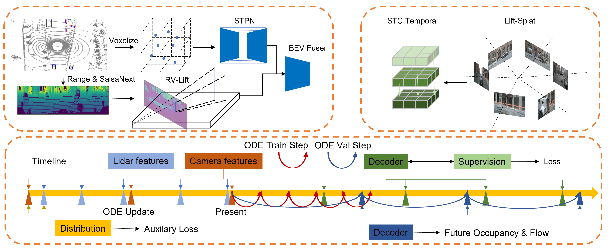

<div align="center">   
  
# FusionMotion: Multi-Sensor Asynchronous Fusion for Continuous Occupancy Prediction via Neural-ODE
</div>

This repo introduces FusionMotion (https://arxiv.org/abs/2206.14451).

## Demo video
<!-- <p align="center">
 <a href="https://opendrivelab.github.io/UniAD/">
    
  </a>
  <a href="https://github.com/OpenDriveLab/UniAD/blob/master/LICENSE">
    
  </a>
  <a href="https://github.com/OpenDriveLab/UniAD/issues?q=is%3Aissue+is%3Aopen+label%3A%22good+first+issue%22">
    
  </a>
</p> -->

<!-- <h3 align="center">
  <a href="https://opendrivelab.github.io/UniAD/">project page</a> |
  <a href="https://arxiv.org/abs/2212.10156">arXiv</a> |
  <a href="">video</a> 
</h3> -->

https://user-images.githubusercontent.com/37300008/219949017-5ab8e53b-3dfb-49f2-a33f-e9a8a451b915.mp4


## Framework


## Abstract

Occupancy maps are widely recognized as an efficient method for facilitating robot motion planning in static environments. However, for intelligent vehicles, occupancy of both the present and future moments is required to ensure safe driving. In the automotive industry, the accurate and continuous prediction of future occupancy maps in traffic scenarios remains a formidable challenge. This paper investigates multi-sensor spatio-temporal fusion strategies for continuous occupancy prediction in a systematic manner. This paper presents FusionMotion, a novel bird's eye view (BEV) occupancy predictor which is capable of achieving the fusion of asynchronous multi-sensor data and predicting the future occupancy map with variable time intervals and temporal horizons. Remarkably, FusionMotion features the adoption of neural ordinary differential equations on recurrent neural networks for occupancy prediction. FusionMotion learns derivatives of BEV features over temporal horizons, updates the implicit sensor's BEV feature measurements and propagates future states for each ODE step. Extensive experiments on large-scale nuScenes and Lyft L5 datasets demonstrate that FusionMotion significantly outperforms previous methods. In addition, it outperforms the BEVFusion-style fusion strategy on the Lyft L5 dataset while reducing synchronization requirements. 


## Contributions

- FusionMotion: A novel and robust multi-sensor asynchronous fusion perception framework for grid-centric perception and prediction that does not fail when a single sensor occasionally fails.  

- SpatialGRU-ODE:  A novel temporal-implicit BEV feature propagation handler that fuses sporadic asynchronous sensor inputs and predicts continuous occupancy flow given any time intervals and any time windows on-demand by training the model only once.

- RV-Lift: A novel representation of range-view LiDAR BEV features for improved instance completion in instance-aware BEV prediction tasks.

- Extensive experiments on two large-scale public datasets, nuScenes and Lyft L5 AV datasets, demonstrate that the proposed method is efficient and effective.
 

## License

All assets and code are under the [Apache 2.0 license](https://github.com/synsin0/FusionMotion/blob/master/LICENSE) unless specified otherwise.

## Citation

Please consider citing our paper if the project helps your research with the following BibTex:

```
@article{
}
```
## Acknowledgements
Thanks to prior excellent open source projects:
- 
- [MotionNet](https://github.com/pxiangwu/MotionNet)
- [FIERY](https://github.com/wayveai/fiery)
- [ST-P3](https://github.com/OpenPerceptionX/ST-P3)
- [BEVerse](https://github.com/zhangyp15/BEVerse)